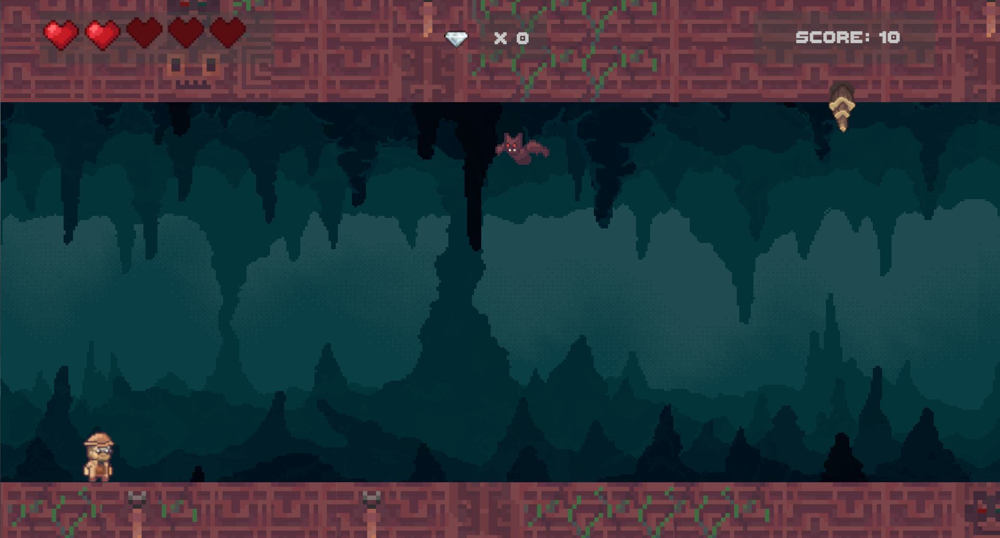
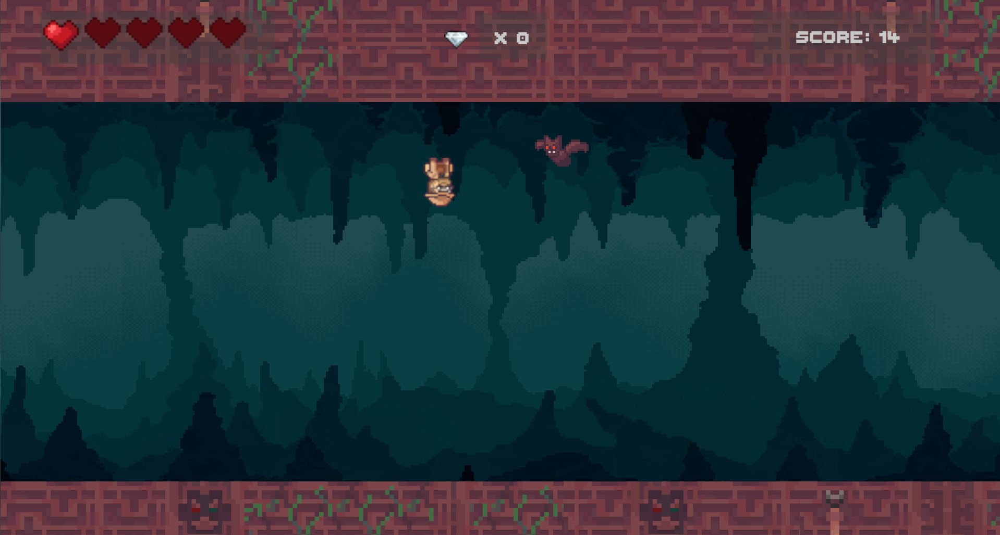

# Running we go!
**Run, survive and escape the horrors hidden inside the cave!**

# Overview
Running We Go is an endeless runner developed in Unity where the player must survive for as long as possible while avoiding enemies and environmental hazards.

The core mechanic allows the player to switch between running on the ground and the ceiling, creating a fast-paced gameplay focused on timing and quick reactions. Players must use this ability to dodge obstacles, avoid enemies, and collect gems while the game's speed countinously increases over time.

# Development 
This project was developed as part of Ubisoft’s 2026 Programming Mentorship Program. The goal of the program was to pair mentees with experienced Ubisoft programmers to receive guidance and hands-on experience while developing a game from start to finish. The game itself was fully designed and developed by me, Claudia Rodriguez, using Unity, C#, and JetBrains Rider.

Art assets, fonts, and the audio were created by third parties and are free to use resources.

## Controls
  - Movement : *AD or Left / Right arrows*
  - Jump between ground and ceiling : *R*
  - Jumping: *W or Up arrow*

# Technical Features

## Generic Object Pooling System
Implemented a reusable pooling system used for enemies, VFX, pickups, and map tiles. 
This reduces runtime instantiation/destruction costs and improves overall performance.

## Scriptable Object Architecture
Used Scriptable Objects to configure pools and spawners, in order to keep systems modular and designer-friendly while reducing hardcoded values.

## Curve-Based Difficulty Scaling
Game speed and difficulty progression are controlled using a customizable curve.
This creates a designer friendly interface, and allows smooth difficulty progression by easily changing max. speed values and time to reach said speed.

## Event-Driven Systems
Implemented event subscriptions to decouple gameplay systems and reduce direct dependencies between scripts.

## Singleton Managers
Used singleton pattern to manage game state, score, audio and global references. This allow to set centralized access points while keeping gameplay logic in separated systems. 

# Project Goals
The objective of this project was to practice and improve system architecture, clean usage of design patterns, modular development, scalable code structure, performance optimziation, and maintainable C# practices.

# How to run the game
Project can be run either locally or online. 
For local build: 
Game ZIP file can be downloaded and the game can be run from the "Menu" scene. No additional set up is requiered.
Onine version:
Game can be played on itch.io: 
